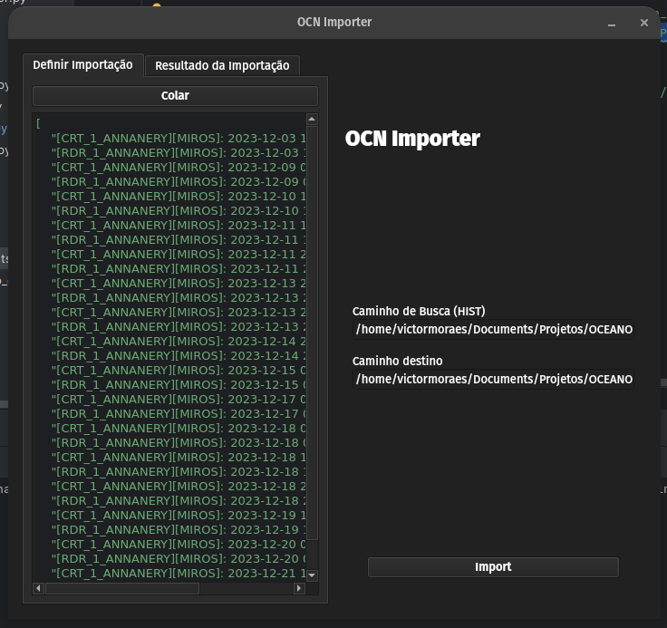

# OCN Importer

O OCN Importer é uma ferramenta projetada para importar dados gerados por sensores meteoceanográficos para um banco de dados. Ele permite que os usuários forneçam uma lista de dados que desejam importar e, em seguida, busca esses dados em uma pasta específica, importando-os para o banco de dados conforme necessário.

## Capturas de Tela



## Funcionalidades

- Importação de dados de sensores meteoceanográficos para um banco de dados.
- Suporte para importar dados com base em uma lista fornecida pelo usuário.
- Interface simples e intuitiva para configurar e executar o processo de importação.

## Instalação 
1. Clone o repositório para o seu sistema local:
```bash
git clone https://github.com/VicktorMS/OcnImporter.git
```

2. Navegue até o diretório do projeto:
```bash
cd OcnImporter
```

3. Instale as dependências:
```bash
pip install -r requirements.txt
```
4. Execute o arquivo principal para iniciar a calculadora:
```bash
python main.py
```
## Licença
Este projeto está licenciado sob a [Licença MIT](LICENSE).

